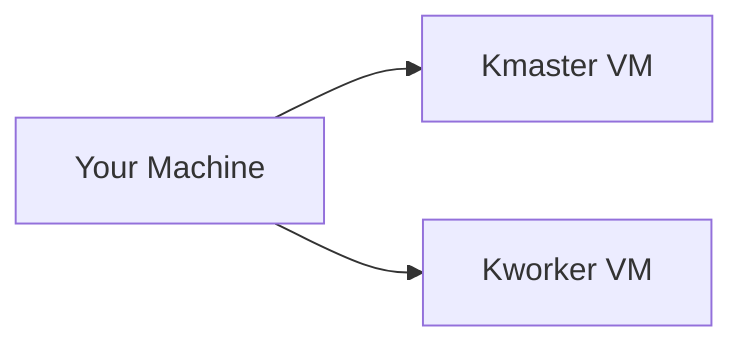

# kubernetes-lab
A step by step guide to learning kubernetes

## kubernetes setup

### Set up nodes

set up two vm's, one to act as kmaster and one as kworker and find their ip addresses. 


NOTE: it would be better to set up ssh into those vms
```sh
ip addr
```

set up hosts resolvers to be able to name those ips, add following to `/etc/hosts` in your machine and vms
```
<master_node_ip> kmaster.example.com kmaster
<worker_node_ip> kworker.example.com kworker
```

test connection 
```sh
ping kmaster
ping kworker
```

---

### Configure nodes

turn off firewall for smooth lab (find security lab in refrences for proper firewall setup in production)
```sh
su -
ufw disable
```
turn off swap to retain node isolation properties as kubernetes support for swap is still not robust
```
su -
swapoff -a; sed -i '/swap/d' /etc/fstab
```
set up sysctl networking configuration for kubernetes
```sh
sudo tee /etc/modules-load.d/containerd.conf <<EOF
overlay
br_netfilter
EOF
```
```sh
sudo modprobe overlay
sudo modprobe br_netfilter
```
```sh
sudo tee /etc/sysctl.d/kubernetes.conf <<EOT
net.bridge.bridge-nf-call-ip6tables = 1
net.bridge.bridge-nf-call-iptables = 1
net.ipv4.ip_forward = 1
EOT
```
```sh
sudo sysctl --system
```

---

### Containerd Runtime & Docker Installation

install dependencies
```sh
sudo apt install -y curl gnupg2 software-properties-common apt-transport-https ca-certificates
```

install docker
```sh
sudo curl -fsSL https://download.docker.com/linux/ubuntu/gpg | sudo gpg --dearmour -o /etc/apt/trusted.gpg.d/docker.gpg
```
```sh
sudo add-apt-repository "deb [arch=$(dpkg --print-architecture)] https://download.docker.com/linux/ubuntu $(lsb_release -cs) stable"
```

install containerd
```sh
sudo apt update
sudo apt install -y containerd.io
```

configure containerd
```sh
containerd config default | sudo tee /etc/containerd/config.toml >/dev/null 2>&1
```
```sh
sudo sed -i 's/SystemdCgroup \= false/SystemdCgroup \= true/g' /etc/containerd/config.toml
```
restart containerd
```sh
sudo systemctl restart containerd
sudo systemctl enable containerd
```

(optional) to avoid using sudo in every docker command add your user to docker group
```sh
sudo usermod -aG docker $USER
getent group
sudo reboot
```

---

### Kubernetes Installation process

NOTE: this might have changed follow official [_documentation_](https://kubernetes.io/docs/setup/production-environment/tools/kubeadm/install-kubeadm/) to install kubeadm

setup kubernetes apt repository
```
curl -fsSL https://pkgs.k8s.io/core:/stable:/v1.28/deb/Release.key | sudo gpg --dearmor -o /etc/apt/keyrings/kubernetes-apt-keyring.gpg
```
```
echo 'deb [signed-by=/etc/apt/keyrings/kubernetes-apt-keyring.gpg] https://pkgs.k8s.io/core:/stable:/v1.28/deb/ /' | sudo tee /etc/apt/sources.list.d/kubernetes.list
```
install kubernetes
```sh
sudo apt-get update
sudo apt-get install -y kubelet kubeadm kubectl
sudo apt-mark hold kubelet kubeadm kubectl
```

---

### Initialise Kubernetes Cluster (on kmaster)

initialise kubeadm
```sh
sudo kubeadm init --control-plane-endpoint=<YOUR_KMASTER_IP>
```

setup kube config for user (as non root user)
```sh
mkdir -p $HOME/.kube
sudo cp -i /etc/kubernetes/admin.conf $HOME/.kube/config
sudo chown $(id -u):$(id -g) $HOME/.kube/config
```

view cluster config
```sh
kubectl config view
kubectl cluster-info
kubectl get nodes
```

setup calico networking plugin for kubernetes
```sh
kubectl apply -f https://raw.githubusercontent.com/projectcalico/calico/v3.26.0/manifests/calico.yaml
```

generate joining token for cluster nodes
```sh
kubeadm token create --print-join-command
```

## References
- [Kubernetes Security Lab](https://devopstales.github.io/kubernetes/k8s-security/#use-firewalld)
- [Video Guide By Just Me And Opensource](https://www.youtube.com/watch?v=Araf8JYQn3w&list=PL34sAs7_26wNBRWM6BDhnonoA5FMERax0)
- [Control Plane Not Runnig Error](https://k21academy.com/docker-kubernetes/container-runtime-is-not-running/#:~:text=This%20is%20a%20common%20issue,toml%20file.)