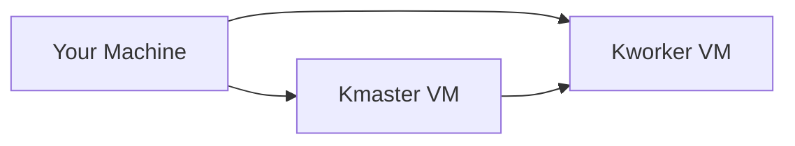

# kubernetes-lab
A step by step guide to learning kubernetes

## kubernetes setup

### Set up nodes

set up two vm's, one to act as kmaster and one as kworker and find their ip addresses. 


NOTE: it would be better to set up ssh into those vms
```sh
ip addr
```

set up hosts resolvers to be able to name those ips, add following to `/etc/hosts` in your machine and vms
```
<master_node_ip> kmaster.example.com kmaster
<worker_node_ip> kworker.example.com kworker
```

test connection 
```sh
ping kmaster
ping kworker
```

---

### Configure nodes

make sure selinux is not enforced in your vm to avoid permission issue later on, if it is enforced disable it
```
sudo apt-get install selinux-utils
setenforce 0
getenforce
```
turn off firewall for smooth lab (find security lab in refrences for proper firewall setup in production)
```sh
su -
ufw disable
```
turn off swap to retain node isolation properties as kubernetes support for swap is still not robust
```
su -
swapoff -a; sed -i '/swap/d' /etc/fstab
```
set up sysctl networking configuration for kubernetes
```sh
cat >>/etc/sysctl.d/kubernetes.conf<<EOF
net.bridge.bridge-nf-call-ip6tables = 1
net.bridge.bridge-nf-call-iptables = 1
EOF
sysctl --system
```

---

### Docker Installation process

NOTE: this might have changed follow official [_documentation_](https://docs.docker.com/engine/install/ubuntu/) to install docker engine

install docker
```sh
sudo apt install docker.io
sudo snap install docker
```

verify docker service is running by
```sh
sudo service docker start
sudo systemctl status docker
```

(optional) to avoid using sudo in every docker command add your user to docker group
```sh
sudo usermod -aG docker $USER
getent group
sudo reboot
```

---

### Kubernetes Installation process

NOTE: this might have changed follow official [_documentation_](https://kubernetes.io/docs/setup/production-environment/tools/kubeadm/install-kubeadm/) to install kubeadm


## References
- [Kubernetes Security Lab](https://devopstales.github.io/kubernetes/k8s-security/#use-firewalld)
- [Video Guide By Just Me And Opensource](https://www.youtube.com/watch?v=Araf8JYQn3w&list=PL34sAs7_26wNBRWM6BDhnonoA5FMERax0)
