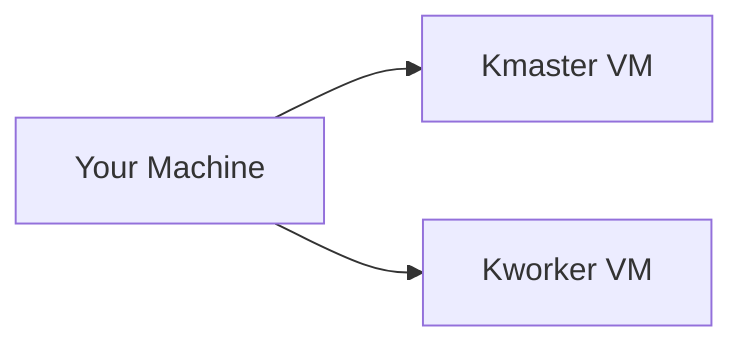

# kubernetes-lab
A step by step guide to learning kubernetes

## kubernetes setup

set up two vm's, one to act as kmaster and one as kworker and find their ip addresses. 


NOTE: it would be better to set up ssh into those vms
```sh
ip addr
```
set up hosts resolvers to be able to name those ips, add following to `/etc/hosts` in your machine and vms
```
<master_node_ip> kmaster.example.com kmaster
<worker_node_ip> kworker.example.com kworker
```
test connection 
```sh
ping kmaster
ping kworker
```
install docker
```sh
sudo apt install docker.io
sudo snap install docker
```
verify docker service is running by
```sh
sudo systemctl status docker
```
(optional) to avoid using sudo in every docker command add your user to docker group
```sh
sudo usermod -aG docker $USER
sudo reboot
```